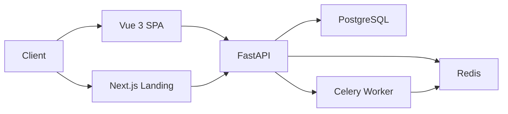

# Technology Stack — Selection & Standards

> This rule defines the **approved tech stack** for all projects. When starting a new project or proposing a new dependency, follow the decision criteria below.

---

## 🗂️ Quick Reference — Approved Stack

### Frontend

| Layer | Primary Choice | Alternative | Avoid |
|-------|---------------|-------------|-------|
| **Framework — Landing/SEO** | Next.js 14+ (App Router) | — | CRA (deprecated) |
| **Framework — Admin/Dashboard** | Vue 3 + Vite | React + Vite | Next.js (overkill for admin) |
| **UI Components** | shadcn/ui + Radix UI | Chakra UI | MUI (too heavy) |
| **Styling** | Tailwind CSS | CSS Modules | Styled-components (runtime cost) |
| **State Management** | Pinia (Vue) / Zustand (React) | — | MobX, Recoil |
| **Data Fetching** | TanStack Query | SWR | Axios alone |
| **Forms** | VeeValidate + Zod | React Hook Form + Zod | — |
| **Testing** | Vitest + Vue Testing Library | Jest | Mocha |
| **E2E Testing** | Playwright | Cypress | Selenium |

### Backend (Python)

| Layer | Primary Choice | Alternative | Avoid |
|-------|---------------|-------------|-------|
| **Framework** | FastAPI | — | Flask (no async), Django (too heavy for API) |
| **Language** | Python 3.12 | — | Python < 3.10 |
| **ORM** | SQLAlchemy 2.0 async | — | Django ORM, Tortoise |
| **Migrations** | Alembic | — | Manual SQL |
| **Validation** | Pydantic v2 | — | marshmallow |
| **Auth** | python-jose + passlib[bcrypt] | — | — |
| **HTTP Client** | httpx (async) | — | requests (blocking) |
| **Queue/Tasks** | Celery + Redis | — | — |
| **Testing** | pytest + httpx | — | unittest |
| **Type Checker** | mypy (strict) | — | — |
| **Linter/Format** | Ruff + Black | — | flake8 + isort |

### Shared Infrastructure

| Layer | Primary Choice | Alternative | Avoid |
|-------|---------------|-------------|-------|
| **Database** | PostgreSQL | — | MySQL (prefer PG) |
| **Cache** | Redis | Upstash Redis | Memcached |
| **Queue — Simple** | BullMQ (JS) / Celery (Python) | — | — |
| **Queue — Enterprise** | RabbitMQ | Kafka (high-throughput) | — |
| **File Storage** | AWS S3 / Cloudflare R2 | Supabase Storage | Local disk |
| **Email** | Resend | SMTP + Nodemailer/smtplib | SendGrid (expensive) |
| **Search** | PostgreSQL FTS (start here) | Meilisearch | Elasticsearch (unless needed) |
| **Monitoring** | Grafana + Prometheus | Datadog | — |
| **CI/CD** | GitHub Actions | — | Jenkins (legacy) |
| **Containers** | Docker + Docker Compose | — | — |
| **Deployment** | Railway/Fly.io (backend) + Vercel (frontend) | AWS | — |
| **API Docs** | FastAPI auto-generated OpenAPI | Swagger/OpenAPI 3.0 | Postman only |

---

## 🐍 Python Backend — FastAPI

### Why FastAPI
- Native async/await (ASGI) — handles concurrent connections efficiently
- Pydantic v2 auto-validates all request/response bodies — no manual schema writing
- OpenAPI docs auto-generated at `/docs` and `/redoc`
- Full type hint support with mypy — catches bugs at development time
- Best-in-class performance for a Python web framework

### Setup
```bash
pip install fastapi uvicorn[standard] sqlalchemy[asyncio] asyncpg alembic \
  pydantic-settings python-jose[cryptography] passlib[bcrypt] httpx \
  structlog prometheus-client slowapi

# Run
uvicorn main:app --reload
```

### App Entry Point
```python
# main.py
from contextlib import asynccontextmanager
from fastapi import FastAPI
from api.v1 import users, orders, auth
from api.middleware.logging import RequestLoggingMiddleware
from api.middleware.metrics import MetricsMiddleware
from shared.exceptions import AppError
from shared.config import settings


@asynccontextmanager
async def lifespan(app: FastAPI):
    # startup
    yield
    # shutdown


app = FastAPI(
    title=settings.app_name,
    version=settings.version,
    lifespan=lifespan,
    docs_url="/docs" if settings.environment != "production" else None,
)

app.add_middleware(RequestLoggingMiddleware)
app.add_middleware(MetricsMiddleware)

app.include_router(auth.router, prefix="/api/v1/auth", tags=["auth"])
app.include_router(users.router, prefix="/api/v1/users", tags=["users"])
app.include_router(orders.router, prefix="/api/v1/orders", tags=["orders"])
```

### Folder Structure → See `project-structure.md`

### Patterns → See `database.md`, `error-handling.md`, `testing.md`

---

## 🖥️ Frontend — Chọn đúng framework

### Decision Table

| Tiêu chí | Next.js 14 (App Router) | Vue 3 + Vite (SPA) |
|----------|------------------------|--------------------|
| **Mục đích** | Landing page, marketing, blog | Admin panel, dashboard, internal tool |
| **SEO** | ✅ SSR/SSG — Google index tốt | ❌ SPA — khó SEO |
| **Lưu trữ** | Vercel (tối ưu nhất) | Cloudflare Pages, Netlify, S3 |
| **Performance** | Server Components — ít JS gửi về client | Client-side rendering |
| **State** | Server Components + Zustand | Pinia |
| **Data Fetching** | TanStack Query (React Query) | TanStack Query (Vue) |
| **API** | API Routes hoặc Server Actions | Gọi FastAPI backend qua axios |
| **Build complexity** | Cao hơn | Đơn giản hơn |

> **Rule**: Một project thường có **cả hai** — Next.js cho public site + Vue 3 cho admin.

---

### Next.js — Landing Page / SEO Project

```bash
npx create-next-app@latest my-landing \
  --typescript --tailwind --eslint --app --src-dir --import-alias "@/*"
```

**Tại sao Next.js cho landing page:**
- Server-Side Rendering (SSR) → Google crawl được nội dung
- Static Site Generation (SSG) → build thành HTML tĩnh, lưu CDN, siêu nhanh
- Image optimization tự động (`next/image`)
- `<head>` metadata API tích hợp sẵn
- Incremental Static Regeneration (ISR) → cập nhật nội dung không rebuild toàn bộ

```tsx
// app/layout.tsx — SEO metadata
export const metadata: Metadata = {
  title: { default: 'My App', template: '%s | My App' },
  description: 'Mô tả trang chính',
  openGraph: { type: 'website', locale: 'vi_VN', url: 'https://myapp.com' },
};
```

**Folder structure (App Router)**
```
src/app/
├── (marketing)/          # Public pages (SSG/SSR)
│   ├── page.tsx          # Homepage
│   ├── about/page.tsx
│   ├── blog/
│   │   ├── page.tsx      # Blog list (SSG)
│   │   └── [slug]/page.tsx  # Blog post (ISR)
│   └── pricing/page.tsx
├── (auth)/               # Auth pages
│   ├── login/page.tsx
│   └── register/page.tsx
└── layout.tsx
```

---

### Vue 3 + Vite — Admin / Dashboard Project

```bash
npm create vite@latest my-admin -- --template vue-ts
cd my-admin && npm install
npm install pinia @tanstack/vue-query axios vee-validate zod @vee-validate/zod
npm install -D vitest @testing-library/vue @vue/test-utils
```

**Tại sao Vue 3 SPA cho admin:**
- Admin panel không cần SEO (đăng nhập mới vào được)
- Pinia là state management chính thức của Vue 3 — đơn giản hơn Redux
- Composition API + `<script setup>` — type-safe và dễ test
- Hot reload nhanh với Vite

**Key Rules:**
- Dùng `<script setup lang="ts">` — không dùng Options API
- Protected routes với auth guard trong Vue Router
- Tất cả API calls qua centralized `apiClient` (axios)
- Xem chi tiết: `vue-patterns.md`

---

## 🗄️ Database — PostgreSQL

### Why PostgreSQL
- ACID compliant, battle-tested
- Excellent JSON support (`jsonb`) — avoids needing MongoDB in most cases
- Full-text search built-in
- Row-level security for multi-tenant apps
- Best ORM support (SQLAlchemy for Python, Prisma/Drizzle for JS)

### Python — SQLAlchemy 2.0 async
Full patterns in `database.md`.

```bash
pip install sqlalchemy[asyncio] asyncpg alembic
```

```bash
# Migrations
alembic revision --autogenerate -m "add_users_table"
alembic upgrade head
alembic downgrade -1
```

### JavaScript — Prisma (TypeScript projects)
```bash
npm install prisma @prisma/client
npx prisma init --datasource-provider postgresql
npx prisma migrate dev --name add_user_role
npx prisma migrate deploy  # production
```

### PostgreSQL Best Practices
- Use UUID / CUID for primary keys (not auto-increment integers for distributed systems)
- Always add index on foreign keys and frequently queried columns
- Use `jsonb` columns for flexible data instead of adding MongoDB
- Enable `pg_trgm` extension for fuzzy search
- Set `statement_timeout` and `lock_timeout` for long queries

---

## ⚡ Cache — Redis

### Why Redis
- Sub-millisecond latency
- Supports strings, hashes, lists, sets, sorted sets, streams
- Built-in TTL, pub/sub, Lua scripts
- Powers caching + queues + rate limiting + sessions

### Python (redis-py async)
```python
# infrastructure/cache/client.py
from redis.asyncio import Redis
from shared.config import settings

redis = Redis.from_url(settings.redis_url, decode_responses=True)

async def get_or_set(key: str, fetcher, ttl: int = 3600):
    cached = await redis.get(key)
    if cached:
        return json.loads(cached)
    data = await fetcher()
    await redis.setex(key, ttl, json.dumps(data))
    return data
```

### JavaScript (ioredis)
```ts
// src/lib/redis.ts
import Redis from 'ioredis';

export const redis = new Redis(process.env.REDIS_URL!, {
  maxRetriesPerRequest: 3,
  lazyConnect: true,
});
```

### Redis Key Naming → See `naming-conventions.md`
```
myapp:v1:user:123:profile    (TTL: 1h)
myapp:v1:session:abc123      (TTL: 7d)
myapp:v1:rate_limit:ip:...   (TTL: 15m)
```

---

## 📨 Queue — Chọn đúng loại

### Decision Table

| Tiêu chí | Celery/BullMQ | RabbitMQ | Kafka |
|----------|--------------|----------|-------|
| **Khi dùng** | Jobs đơn giản, retry, schedule | Microservices, routing phức tạp | Event streaming, log, billions messages |
| **Setup** | Redis có sẵn | Cài thêm RabbitMQ | Cài thêm Kafka + Zookeeper |
| **Retry** | ✅ Built-in | ✅ Dead Letter Queue | ✅ Consumer offset |
| **Ordering** | ❌ Không đảm bảo | ✅ Per-queue | ✅ Per-partition |
| **Replay** | ❌ | ❌ | ✅ Có thể replay |
| **Độ phức tạp** | Thấp | Trung bình | Cao |

> **Rule**: Mặc định dùng **Celery** (Python) hoặc **BullMQ** (JS). Chỉ dùng RabbitMQ khi microservices. Chỉ dùng Kafka khi cần stream lớn hoặc replay.

### Celery — Python Default
```python
# jobs/celery_app.py
from celery import Celery
from shared.config import settings

celery_app = Celery(
    "tasks",
    broker=settings.redis_url,
    backend=settings.redis_url,
)
celery_app.conf.task_routes = {"jobs.tasks.*": {"queue": "default"}}

# jobs/tasks/email.py
from jobs.celery_app import celery_app

@celery_app.task(bind=True, max_retries=3, default_retry_delay=60)
def send_welcome_email(self, user_id: str) -> None:
    try:
        ...
    except Exception as exc:
        raise self.retry(exc=exc)
```

### BullMQ — JavaScript Default
```ts
import { Queue } from 'bullmq';
import { redis } from '@/lib/redis';

export const emailQueue = new Queue('email', {
  connection: redis,
  defaultJobOptions: { attempts: 3, backoff: { type: 'exponential', delay: 2000 } },
});
await emailQueue.add('send-welcome', { to: user.email, name: user.name });
```

### Queue Naming → See `naming-conventions.md`

---

## 📄 Documentation

### API Documentation

**FastAPI:**
- OpenAPI docs auto-generated at `/docs` (Swagger UI) and `/redoc`
- Add `summary`, `description`, `response_model`, and `responses` to endpoints
- No extra dependencies needed

```python
@router.get(
    "/{user_id}",
    response_model=UserResponse,
    responses={404: {"model": ErrorResponse}},
    summary="Get user by ID",
)
async def get_user(user_id: str, db: AsyncSession = Depends(get_db)) -> UserResponse:
    ...
```

**Express/Node:**
```bash
npm install swagger-ui-express @asteasolutions/zod-to-openapi
```
- Auto-generate from Zod schemas
- Mount at `/api-docs`
- Keep `openapi.yaml` committed to repo

### README Template (mandatory for every service)

**Python backend:**
```markdown
# Service Name

## What it does (1-2 sentences)

## Tech Stack
- Runtime: Python 3.12
- Framework: FastAPI
- Database: PostgreSQL (SQLAlchemy 2.0 + Alembic)
- Cache: Redis

## Quick Start
\`\`\`bash
cp .env.example .env
pip install -r requirements.txt
alembic upgrade head
uvicorn main:app --reload
\`\`\`

## Environment Variables → see .env.example
## API Documentation → /docs (dev only)
## Architecture → docs/architecture.md
```

### Architecture Diagrams (docs/architecture/)
- Use **Mermaid** for all diagrams (version-controlled, no external tools)
- Required diagrams: System context, Component diagram, Data flow, DB ERD



---

## ✅ Technology Decision Process

When **proposing a new library or technology**, evaluate against these criteria:

| Criterion | Questions to ask |
|-----------|-----------------|
| **Necessity** | Does an approved alternative already solve this? |
| **Maintenance** | Stars > 1k? Last commit < 6 months? |
| **Type support** | Native type hints (Python) / native TS types (JS)? |
| **Bundle size** | Check bundlephobia.com (JS) — is it worth the KB? |
| **License** | Is it MIT/Apache? (No GPL in commercial products) |
| **Security** | `npm audit` / `pip-audit` — zero high/critical vulnerabilities |
| **Community** | Active issues/discussions? Stack Overflow answers? |

### Decision Template
```markdown
## Technology Decision: [Library Name]

**Problem**: What problem does this solve?
**Alternative evaluated**: What from the approved stack was considered?
**Why chosen**: Specific reason this is better for the use case
**Risk**: Known downsides or migration cost
**Decision**: ✅ Adopt / ❌ Reject
```
